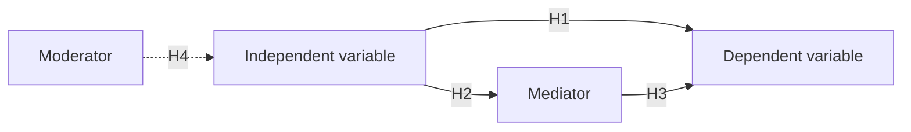

# Research Framework Skill

## Mục Tiêu

Giúp người dùng biến một ý tưởng nghiên cứu thành khung lý thuyết có thể bảo vệ:
lý thuyết nền rõ, khái niệm nghiên cứu được định nghĩa, quan hệ có cơ chế, giả thuyết có
bằng chứng và mô hình có thể kiểm định bằng dữ liệu.

## Đầu Vào Tối Thiểu

Hỏi tối đa 3 câu khi thiếu thông tin:

1. Đề tài, lĩnh vực và bối cảnh nghiên cứu là gì?
2. Người dùng đã có biến phụ thuộc hoặc hiện tượng cần giải thích chưa?
3. Nghiên cứu dự kiến định lượng, định tính hay mixed methods?

## Nguyên Tắc Vận Hành

- Không chọn lý thuyết chỉ vì quen thuộc; phải so sánh với lý thuyết cạnh tranh.
- Không thêm biến nếu không có vai trò lý thuyết hoặc không thể đo lường.
- Không viết giả thuyết nhân quả nếu thiết kế nghiên cứu không hỗ trợ.
- Với nguồn học thuật, cần trích dẫn thật hoặc đánh dấu `Cần kiểm tra nguồn`.

## Quy Trình 6 Bước

### Bước 1: Làm Rõ Bài Toán Nghiên Cứu

Xác định:

- Hiện tượng hoặc vấn đề thực tiễn.
- Dependent variable hoặc outcome.
- Đơn vị phân tích: cá nhân, nhóm, tổ chức, ngành hay quốc gia.
- Bối cảnh: quốc gia, ngành, thời điểm, công nghệ, chính sách.
- Mục tiêu và câu hỏi nghiên cứu.

Mẫu đầu ra:

| Thành phần | Nội dung |
|---|---|
| Research problem |  |
| Research objective |  |
| RQ1 |  |
| Unit of analysis |  |
| Context |  |

### Bước 2: Theory Mapping

Tìm ít nhất 2-3 lý thuyết có thể giải thích hiện tượng. Với mỗi lý thuyết, điền:

| Lý thuyết | Core proposition | Level | Construct phù hợp | Điểm mạnh | Hạn chế |
|---|---|---|---|---|---|
| TAM | Chấp nhận công nghệ dựa trên usefulness và ease of use | Cá nhân | PU, PEOU, intention | Dễ đo lường | Ít yếu tố xã hội |
| RBV | Nguồn lực giá trị, hiếm, khó bắt chước tạo lợi thế | Tổ chức | Capability, performance | Phù hợp firm-level | Ít động |
| Institutional Theory | Áp lực thể chế thúc đẩy hành vi tổ chức | Tổ chức/ngành | Coercive, mimetic, normative pressure | Hợp bối cảnh chính sách | Ít giải thích năng lực nội tại |

Luận điểm chọn lý thuyết:

```text
Although [Theory B] explains [aspect], it does not fully address [mechanism].
In contrast, [Theory A] is more suitable because it explains [mechanism] at
[level of analysis] and has been applied in [similar context].
```

### Bước 3: Construct Definition

Mỗi construct cần có:

- Định nghĩa gốc từ literature.
- Định nghĩa làm việc trong nghiên cứu này.
- Vai trò trong mô hình.
- Cách đo lường hoặc quan sát.
- Nguồn thang đo nếu là định lượng.

Template:

| Construct | Định nghĩa gốc | Định nghĩa trong nghiên cứu | Vai trò | Scale/indicator |
|---|---|---|---|---|
| Digital leadership |  |  | IV |  |
| Tri thức sharing |  |  | Mediator |  |
| Innovation performance |  |  | DV |  |

### Bước 4: Operationalization

Kiểm tra reflective hoặc formative:

| Loại construct | Dấu hiệu | Phân tích phù hợp |
|---|---|---|
| Reflective | Items là biểu hiện của construct | CFA, CB-SEM, PLS reflective |
| Formative | Items tạo thành construct | PLS-SEM formative, kiểm tra VIF và weights |

Quy tắc:

- Mỗi reflective construct nên có ít nhất 3 items.
- Không trộn level cá nhân và tổ chức nếu không giải thích multi-level.
- Nếu dịch thang đo, cần back-translation hoặc expert review khi phù hợp.

### Bước 5: Mô Hình Khái Niệm (Conceptual Model)

Mỗi path trong mô hình cần có 3 lớp lập luận:

1. Theory: lý thuyết dự đoán gì?
2. Mechanism: tại sao A liên quan đến B?
3. Evidence: nghiên cứu trước tìm thấy gì?

Mermaid template:



### Bước 6: Hypothesis Development

Format chuẩn:

```text
H1: [Construct A] is positively/negatively associated with [Construct B].

Rationale:
Drawing on [Theory], [core proposition]. In this study, [mechanism in context].
Prior studies have shown [evidence]. Therefore, H1 is proposed.
```

Các loại hypothesis:

| Loại | Câu hỏi kiểm tra | Ví dụ |
|---|---|---|
| Direct effect | A liên quan B như thế nào? | A -> B |
| Mediation | M giải thích cơ chế A -> B không? | A -> M -> B |
| Moderation | W làm quan hệ mạnh/yếu hơn không? | A x W -> B |
| Multi-group | Quan hệ khác nhau giữa nhóm không? | Nam vs nữ, SME vs large firm |

## Checklist Framework

- [ ] Có ít nhất 2 lý thuyết cạnh tranh đã được cân nhắc.
- [ ] Mỗi construct có định nghĩa và vai trò rõ.
- [ ] Mỗi hypothesis có theory, mechanism và evidence.
- [ ] Mô hình không có quan hệ vòng tròn vô lý.
- [ ] Level of analysis nhất quán.
- [ ] Measurement khả thi với dữ liệu dự kiến.
- [ ] Claim nhân quả phù hợp thiết kế nghiên cứu.

## Kết Quả Đề Xuất

- Theory mapping matrix.
- Construct operationalization table.
- Mô hình khái niệm.
- Hypotheses và rationale.
- Chapter 2 outline.
- Các mục tri thức trong `kho-tri-thuc/theories` và `kho-tri-thuc/constructs`.
