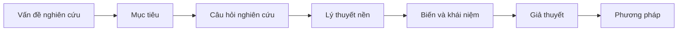

# Kiểm tra logic khung nghiên cứu

## Mục tiêu

Giúp người nghiên cứu rà soát tính nhất quán của toàn bộ khung: câu hỏi nghiên cứu, mục tiêu, lý thuyết, biến, giả thuyết và phương pháp phải nối liền mạch. Đích đến là phát hiện và sửa các điểm đứt mạch logic, biến không đo được, và giả thuyết thiếu cơ sở lý thuyết trước khi nộp.

## Khi nào dùng

- Khi đã có bản nháp khung hoàn chỉnh và cần soát trước khi bảo vệ.
- Khi phản biện chỉ ra khung thiếu nhất quán.
- Khi nghi ngờ có biến thừa, giả thuyết không gắn lý thuyết, hoặc phương pháp không khớp giả thuyết.
- Khi cần một checklist soát cuối.

## Nội dung chuyên môn

### Chuỗi nhất quán cần kiểm tra

Mỗi mắt xích phải dẫn ra mắt xích sau. Nếu một câu hỏi nghiên cứu không có giả thuyết tương ứng, hoặc một giả thuyết không trả lời câu hỏi nào, đó là điểm đứt mạch.

### Ma trận đối chiếu

| Câu hỏi NC | Mục tiêu | Giả thuyết | Biến liên quan | Phương pháp kiểm định |
|---|---|---|---|---|
| RQ1 | MT1 | H1, H2 | A, M, B | SEM |
| RQ2 | MT2 | H5 | A, W | Phân tích điều tiết |

Mỗi hàng phải đầy đủ; ô trống là dấu hiệu thiếu liên kết.

### Các lỗi đứt mạch thường gặp

| Lỗi | Dấu hiệu | Cách sửa |
|---|---|---|
| Câu hỏi không có giả thuyết | RQ nêu ra nhưng không có H tương ứng | Thêm giả thuyết hoặc bỏ RQ |
| Giả thuyết mồ côi | H không trả lời RQ nào | Gắn H vào RQ hoặc loại H |
| Biến không đo được | Khái niệm không có định nghĩa thao tác hoặc thang đo | Thao tác hóa lại hoặc thay biến |
| Giả thuyết thiếu lý thuyết | H không có Theory-Mechanism-Evidence | Bổ sung cơ sở hoặc loại bỏ |
| Lệch cấp độ phân tích | Biến trộn cấp cá nhân và tổ chức | Thống nhất cấp hoặc dùng khung đa cấp |
| Phương pháp không khớp | Giả thuyết trung gian nhưng không có kiểm định trung gian | Đổi phương pháp cho khớp |
| Claim nhân quả quá mức | Thiết kế cắt ngang nhưng phát biểu nhân quả | Hạ về quan hệ tương quan |

## Quy trình các bước

1. Thu thập đủ vấn đề, mục tiêu, câu hỏi, lý thuyết, biến, giả thuyết, phương pháp.
2. Lập ma trận đối chiếu câu hỏi với mục tiêu, giả thuyết, biến, phương pháp.
3. Truy chuỗi nhất quán từ vấn đề tới phương pháp, đánh dấu mọi điểm đứt mạch.
4. Kiểm tra từng biến có định nghĩa thao tác và thang đo không.
5. Kiểm tra từng giả thuyết có đủ Theory-Mechanism-Evidence và hướng tác động không.
6. Kiểm tra phương pháp có kiểm định được mọi loại giả thuyết không.
7. Lập danh sách lỗi kèm đề xuất sửa theo thứ tự ưu tiên.

## Đầu ra

- Ma trận đối chiếu câu hỏi đến mục tiêu đến giả thuyết đến biến đến phương pháp.
- Danh sách điểm đứt mạch logic kèm vị trí cụ thể.
- Danh sách biến không đo được và giả thuyết thiếu cơ sở lý thuyết.
- Checklist soát cuối đã đánh dấu đạt hoặc chưa đạt.

## Checklist soát cuối

- [ ] Mỗi câu hỏi nghiên cứu có ít nhất một giả thuyết tương ứng.
- [ ] Mỗi giả thuyết trả lời đúng một câu hỏi nghiên cứu.
- [ ] Mỗi biến có định nghĩa thao tác và thang đo khả thi.
- [ ] Mỗi giả thuyết có Theory-Mechanism-Evidence và hướng tác động rõ.
- [ ] Cấp độ phân tích nhất quán trong toàn mô hình.
- [ ] Phương pháp kiểm định được mọi loại giả thuyết (trực tiếp, trung gian, điều tiết).
- [ ] Claim nhân quả phù hợp với thiết kế nghiên cứu.

## Lưu ý liêm chính

- Không che giấu điểm đứt mạch bằng cách viết mơ hồ; nêu thẳng lỗi và đề xuất sửa.
- Không giữ biến hoặc giả thuyết chỉ vì đã viết nhiều; loại bỏ nếu không có vai trò.
- Mọi đề xuất bổ sung nguồn phải dựa trên tài liệu thật; nếu chưa chắc, ghi `Cần kiểm tra nguồn`.
- Phân biệt rõ quan hệ tương quan và nhân quả theo đúng thiết kế đã chọn.
