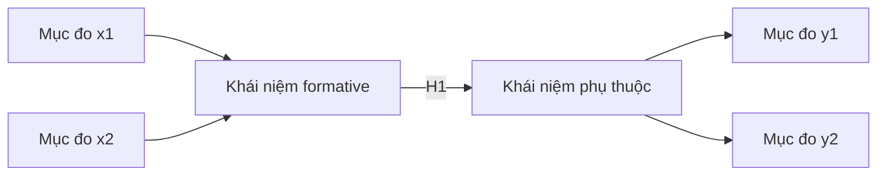

# Tạo mô hình nghiên cứu

## Mục tiêu

Giúp người nghiên cứu vẽ mô hình nghiên cứu dưới dạng sơ đồ đường dẫn (path diagram): đặt các biến đúng vai trò, nối bằng mũi tên gắn nhãn giả thuyết H1-Hn, và thể hiện đúng quy ước reflective/formative cũng như biến trung gian, điều tiết. Đích đến là một hình mô hình có thể đưa vào luận án.

## Khi nào dùng

- Khi đã có biến, vai trò và giả thuyết, cần dựng sơ đồ tổng thể.
- Khi cần kiểm tra mô hình có quan hệ vòng tròn vô lý không.
- Khi cần thể hiện biến trung gian hoặc điều tiết trên sơ đồ.
- Khi cần một hình minh họa Mermaid cho bản nháp.

## Nội dung chuyên môn

### Quy ước vẽ sơ đồ đường dẫn

| Thành phần | Quy ước phổ biến | Trên sơ đồ |
|---|---|---|
| Biến tiềm ẩn (construct) | Hình elip/hộp bo tròn | Node có tên khái niệm |
| Mục đo (indicator) | Hình chữ nhật | Thường ẩn ở mô hình khái niệm, hiện ở mô hình đo lường |
| Quan hệ giả thuyết | Mũi tên liền nét có nhãn H | A --> B gắn H1 |
| Tác động điều tiết | Mũi tên đứt nét trỏ vào một quan hệ | W -.-> quan hệ A đến B |

### Quy ước reflective và formative trên sơ đồ

| Dạng | Chiều mũi tên giữa khái niệm và mục đo | Ghi nhớ |
|---|---|---|
| Reflective | Từ khái niệm trỏ ra mục đo | Khái niệm gây ra biểu hiện |
| Formative | Từ mục đo trỏ vào khái niệm | Mục đo tạo nên khái niệm |

### Biến trung gian và điều tiết trên sơ đồ

- Trung gian (M): nằm giữa, có hai mũi tên A đến M và M đến B.
- Điều tiết (W): mũi tên đứt nét trỏ vào thân quan hệ A đến B, không trỏ trực tiếp vào B.

### Sơ đồ mô hình khái niệm minh họa

Trong sơ đồ: A là biến độc lập, B là biến phụ thuộc, M là biến trung gian (H1 và H2 tạo nên đường gián tiếp H3), H4 là tác động trực tiếp, W là biến điều tiết tác động lên quan hệ A đến M.

### Sơ đồ tách reflective và formative minh họa

Khái niệm formative nhận mũi tên từ các mục đo; khái niệm phụ thuộc dạng reflective trỏ mũi tên ra các mục đo.

## Quy trình các bước

1. Liệt kê biến và vai trò: độc lập, phụ thuộc, trung gian, điều tiết, kiểm soát.
2. Sắp biến độc lập bên trái, biến phụ thuộc bên phải, trung gian ở giữa.
3. Nối các quan hệ giả thuyết bằng mũi tên và gắn nhãn H1-Hn.
4. Đặt biến điều tiết bằng mũi tên đứt nét trỏ vào quan hệ tương ứng.
5. Đánh dấu dạng đo reflective/formative cho mỗi khái niệm nếu cần mô hình đo lường.
6. Rà soát không có vòng lặp vô lý và cấp độ phân tích nhất quán.
7. Xuất sơ đồ Mermaid và mô tả chú giải.

## Đầu ra

- Sơ đồ mô hình khái niệm dạng Mermaid với nhãn H1-Hn.
- Chú giải vai trò từng biến và ý nghĩa từng mũi tên.
- Ghi chú dạng đo reflective/formative cho mỗi khái niệm.
- Mô hình đo lường tách riêng nếu cần cho phần phương pháp.

## Lưu ý liêm chính

- Mô hình chỉ vẽ quan hệ đã có giả thuyết và cơ sở lý thuyết, không thêm mũi tên trang trí.
- Không tạo quan hệ vòng tròn vô lý hoặc mâu thuẫn với hướng giả thuyết.
- Giữ cấp độ phân tích nhất quán giữa các biến trong cùng mô hình.
- Nhãn node trong Mermaid phải bọc trong ngoặc kép và tránh ký tự đặc biệt chưa bọc.
